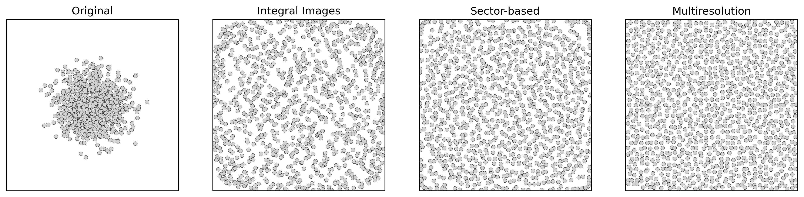

# Density-Equalizing Transformations

This repository contains reference implementations for my PhD thesis: **Density-Equalizing Transformations for Scatterplots**. It provides the following 2D density-equalizing transformations implemented in C++17 and CUDA, with Python bindings created using `nanobind`.

**1. Integral images**: A CUDA-accelerated GPU implementation of the integral-image-based algorithm presented in
> **H. Rave**, V. Molchanov, and L. Linsen, "De-cluttering Scatterplots with Integral Images," *IEEE Transactions on Visualization and Computer Graphics*, vol. 31, no. 4, pp. 2114–2126, 2025. DOI: [10.1109/TVCG.2024.3381453](https://doi.org/10.1109/TVCG.2024.3381453)

**2. Sector-based**: A CPU implementation of the sector-based algorithm presented in
> **H. Rave**, V. Molchanov, and L. Linsen, "Uniform Sample Distribution in Scatterplots via Sector-Based Transformation," *IEEE Visualization and Visual Analytics*, pp. 156–160, 2024. DOI: [10.1109/VIS55277.2024.00039](https://doi.org/10.1109/VIS55277.2024.00039)

**3. Multiresolution**: A CUDA-accelerated GPU implementation of the multiresolution algorithm presented in
> **H. Rave**, V. Molchanov, Y. Tatsukawa, Q. Quang Ngo, S. Frey, T. Igarashi, and L. Linsen, "Multiresolution Density-Equalizing Transformation for Scatterplots," *IEEE Transactions on Visualization and Computer Graphics*, 2026. *Under review.*

## Prerequisites

- **CUDA Toolkit** (>= 11.0)
- **CMake** (>= 3.18)
- A C++17 compliant compiler (GCC, Clang, MSVC)
- **Python** (>= 3.8) with `numpy` and `matplotlib` (for visualizations)

## Installation

The Python extension handles the underlying C++/CUDA compilation via `scikit-build-core`. Ensure your CUDA environment variables are set, then run:

```bash
pip install .
```

## Usage

A visualization script (`example.py`) is provided to run all three transformations side-by-side on a synthetic point cloud. To execute it:

```bash
python example.py
```

### Expected Output


## Citation

If you use any of the algorithms or this codebase in your research, please cite the corresponding paper:

**1. Integral images**
```bibtex
@article{rave2025_integral_images,
  title     = {De-Cluttering Scatterplots With Integral Images}, 
  author    = {Rave, Hennes and Molchanov, Vladimir and Linsen, Lars},
  year      = {2025},
  journal   = {IEEE Transactions on Visualization and Computer Graphics}, 
  volume    = {31},
  number    = {4},
  pages     = {2114--2126},
  doi       = {10.1109/TVCG.2024.3381453}
}
```

**2. Sector-based**
```bibtex
@inproceedings{rave2024_sector_based,
  title     = {Uniform Sample Distribution in Scatterplots via Sector-Based Transformation},
  author    = {Rave, Hennes and Molchanov, Vladimir and Linsen, Lars},
  year      = {2024},
  booktitle = {IEEE Visualization and Visual Analytics},
  pages     = {156--160},
  doi       = {10.1109/VIS55277.2024.00039}
}
```

**3. Multiresolution**
```bibtex
@article{rave2026_multiresolution,
  title   = {Multiresolution Density-Equalizing Transformation for Scatterplots},
  author  = {Rave, Hennes and Molchanov, Vladimir and Tatsukawa, Yuki and Ngo, Quynh Quang and Frey, Steffen and Igarashi, Takeo and Linsen, Lars},
  year    = {2026},
  journal = {IEEE Transactions on Visualization and Computer Graphics},
  note    = {Under review}
}
```